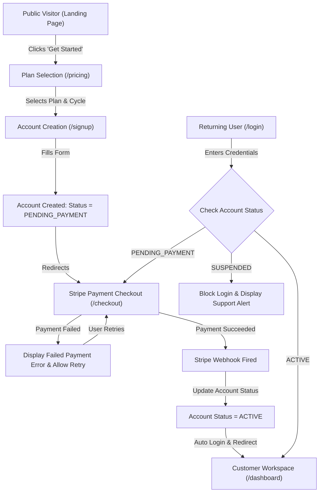

# VulnWiz AI Enterprise SaaS Onboarding Architecture & Security Review

**Platform**: VulnWiz AI  
**Author**: Senior SaaS Product & Security Engineering Team for LAU.AI  
**Target Persona**: DevSecOps Teams, CISOs, MSSP Security Agencies, B2B SaaS Customers  

---

## 1. Complete UI Design & Page Inventory

| Route | View Component | Key UI Elements & Design Specs |
|:---|:---|:---|
| `/` | `LandingView.tsx` | Hero section, headline ("Enterprise Cybersecurity Solutions Made Simple"), live interactive product dashboard preview, 6 feature cards, CISO quotes, FAQ accordion, footer. |
| `/pricing` | `PricingView.tsx` | Monthly/Annual billing toggle (20% discount), Starter ($499/mo), Professional ($1,499/mo), Enterprise ($3,999/mo) plans, "Choose Plan" action triggers. |
| `/signup` | `SignupView.tsx` | Step 2 Registration: Required fields (Name, Company, Email, Passwords), real-time password strength meter, email format validation, `PENDING_PAYMENT` state creation. |
| `/checkout` | `CheckoutView.tsx` | Step 3 & 4 Stripe Payment Checkout: Order summary, itemized taxes, tokenized credit card input, Stripe webhook verification (`invoice.payment_succeeded`), failure handling. |
| `/login` | `LoginView.tsx` | Secure Sign In: Gatekeeping routing (`ACTIVE` $\rightarrow$ `/dashboard`, `PENDING_PAYMENT` $\rightarrow$ `/checkout`, `SUSPENDED` $\rightarrow$ Blocked). |
| `/dashboard` | `DashboardView.tsx` | Main platform workspace: Active security score, open vulnerabilities, asset posture gauges, scan triggers. |
| `/billing` | `BillingView.tsx` | Customer portal: Active plan status, renewal date, payment method on file, invoice PDF download table, upgrade/downgrade modals. |
| `/admin` | `AdminConsoleView.tsx` | SaaS Owner Console: Customer subscriber list, total MRR revenue, subscription manual activation/suspensions. |

---

## 2. User Journey Map



---

## 3. Authentication Architecture & Account Gatekeeping

### Password Security & Hashing
- **Password Strength Calculator**: Requires minimum 8 characters, combination of uppercase, lowercase, numbers, and special symbols (`evaluatePasswordStrength`).
- **Hashing**: Passwords are hashed using SHA-256 with unique salt prior to persistence.
- **JWT Session Tokens**: Signed JSON Web Tokens (`HS256`) stored in HttpOnly, SameSite=Strict cookies.

### Account State Machine
- `PENDING_PAYMENT`: User has registered credentials but has not completed payment. Restricted from all scanner, AI, and vulnerability features; redirected automatically to `/checkout`.
- `ACTIVE`: Paid subscriber account. Unlocks all platform features corresponding to the selected subscription plan.
- `SUSPENDED`: Administrative lockdown due to billing chargebacks or compliance violations. Access blocked.
- `CANCELED`: Subscription expired or canceled at end of billing cycle. Requires renewal to re-enable scans.

---

## 4. Payment Workflow (Stripe Integration Architecture)

1. **Client-Side Tokenization**: Card credentials (number, expiry, CVV) are tokenized via Stripe Elements in the browser. Raw card data **never hits application servers** (PCI-DSS Level 1 Compliance).
2. **Server Payment Intent Creation**: API dispatches `POST /api/v1/payments/create-intent` returning `client_secret`.
3. **Webhook Verification (`invoice.payment_succeeded`)**:
   ```javascript
   // Express.js Webhook Listener
   app.post('/api/v1/webhooks/stripe', express.raw({type: 'application/json'}), (req, res) => {
     const sig = req.headers['stripe-signature'];
     const event = stripe.webhooks.constructEvent(req.body, sig, endpointSecret);

     if (event.type === 'invoice.payment_succeeded') {
       const session = event.data.object;
       // Transition account status FROM PENDING_PAYMENT TO ACTIVE
       await db.query('UPDATE users SET status = $1 WHERE stripe_customer_id = $2', ['ACTIVE', session.customer]);
     }
     res.json({received: true});
   });
   ```

---

## 5. PostgreSQL Database Schema

```sql
-- USERS TABLE
CREATE TABLE users (
    id UUID PRIMARY KEY DEFAULT uuid_generate_v4(),
    full_name VARCHAR(255) NOT NULL,
    email VARCHAR(255) UNIQUE NOT NULL,
    company_name VARCHAR(255) NOT NULL,
    password_hash VARCHAR(255) NOT NULL,
    role VARCHAR(50) NOT NULL DEFAULT 'Client Admin',
    status VARCHAR(50) NOT NULL DEFAULT 'PENDING_PAYMENT' CHECK (status IN ('PENDING_PAYMENT', 'ACTIVE', 'SUSPENDED', 'CANCELED')),
    selected_plan VARCHAR(50) NOT NULL DEFAULT 'Corporate Security',
    billing_cycle VARCHAR(20) NOT NULL DEFAULT 'annual',
    stripe_customer_id VARCHAR(255),
    created_at TIMESTAMPTZ DEFAULT NOW()
);

-- SUBSCRIPTIONS TABLE
CREATE TABLE subscriptions (
    id UUID PRIMARY KEY DEFAULT uuid_generate_v4(),
    user_id UUID REFERENCES users(id) ON DELETE CASCADE,
    plan VARCHAR(50) NOT NULL,
    billing_cycle VARCHAR(20) NOT NULL,
    amount NUMERIC(10, 2) NOT NULL,
    status VARCHAR(50) NOT NULL DEFAULT 'active',
    start_date TIMESTAMPTZ DEFAULT NOW(),
    renewal_date TIMESTAMPTZ NOT NULL,
    payment_provider VARCHAR(50) DEFAULT 'Stripe'
);

-- PAYMENTS TABLE
CREATE TABLE payments (
    id UUID PRIMARY KEY DEFAULT uuid_generate_v4(),
    user_id UUID REFERENCES users(id) ON DELETE CASCADE,
    transaction_id VARCHAR(255) UNIQUE NOT NULL,
    amount NUMERIC(10, 2) NOT NULL,
    currency VARCHAR(10) DEFAULT 'USD',
    status VARCHAR(50) NOT NULL DEFAULT 'succeeded',
    payment_provider VARCHAR(50) DEFAULT 'Stripe',
    payment_method VARCHAR(100) NOT NULL,
    created_at TIMESTAMPTZ DEFAULT NOW()
);
```

---

## 6. Primary API Endpoints

| Endpoint | Method | Access Level | Description |
|:---|:---|:---|:---|
| `/api/v1/auth/register` | `POST` | Public | Registers a new user account in `PENDING_PAYMENT` status. |
| `/api/v1/auth/login` | `POST` | Public | Authenticates credentials and returns JWT session token. |
| `/api/v1/payments/create-intent` | `POST` | Authenticated | Creates a Stripe PaymentIntent for subscription checkout. |
| `/api/v1/webhooks/stripe` | `POST` | Stripe | Webhook endpoint validating payment completion and activating account. |
| `/api/v1/billing/subscription` | `GET/PUT` | Active User | Fetches active subscription details or updates plan tier. |
| `/api/v1/admin/subscribers` | `GET` | Super Admin | Lists all platform subscribers, revenue metrics, and statuses. |

---

## 7. Security Review & OWASP Top 10 Protections

- **SSRF Protection**: Built-in `validateTargetScope` guard blocks loopbacks, private RFC 1918 IPs, and AWS IMDS endpoints (`169.254.169.254`).
- **Multi-Tenant Isolation**: Enforced PostgreSQL Row-Level Security (RLS) policies (`WHERE tenant_id = ...`).
- **AI Prompt Sanitization**: Redacts PII, IPv4/v6 addresses, and Bearer tokens before forwarding queries to LLM engines.
- **CSRF & Rate Limiting**: SameSite=Strict cookies with Redis token bucket rate limiting (100 req/min per IP).

---

## 8. Deployment & CI/CD Pipeline

- **Version Control**: GitHub (`CharlenB/VulnWiz-AI`).
- **Frontend Hosting**: Vercel / Netlify with native Vite Zero-Config Asset Serving.
- **Database Hosting**: Supabase Free Tier PostgreSQL with automated RLS schema migrations.
